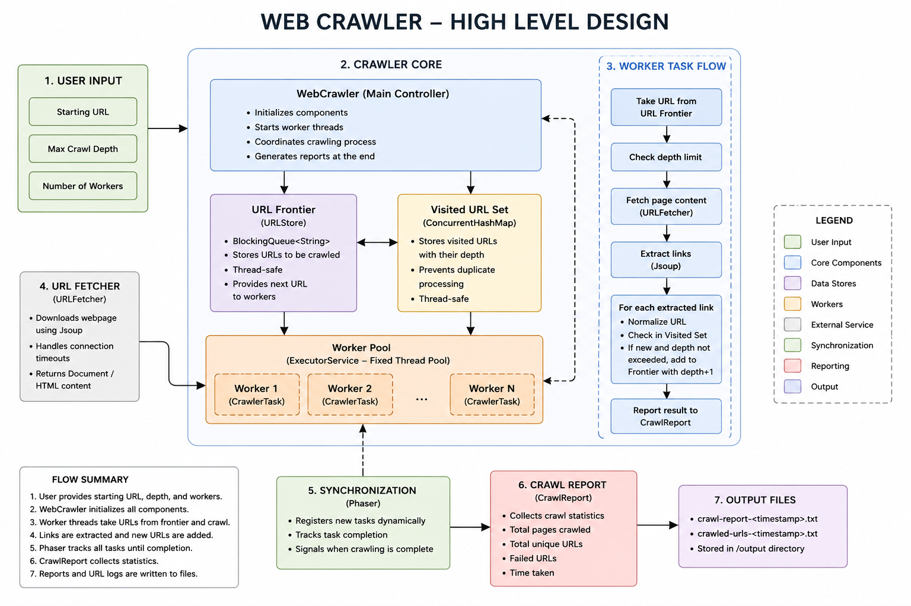

# Java Web Crawler

A multithreaded web crawler built in Java that crawls web pages up to a user-defined depth using multiple worker threads. The crawler extracts links from web pages, prevents duplicate URL processing, and generates timestamped crawl reports and URL logs.

## Tech Stack

- Java
- Maven
- Jsoup
- ExecutorService
- Phaser

## Algorithms and Data Structures

- ConcurrentHashMap — thread-safe tracking of visited URLs
- BlockingQueue — thread-safe URL queue for pending URLs
- Fixed Thread Pool — manages concurrent crawler workers
- Phaser — coordinates dynamically created crawler tasks
- Depth-Limited Crawling — controls how far the crawler traverses from the starting URL
- URL Deduplication — prevents the same URL from being crawled multiple times
- Multithreaded Task Execution — processes multiple URLs concurrently

## High-Level Design

## Low-Level Design

